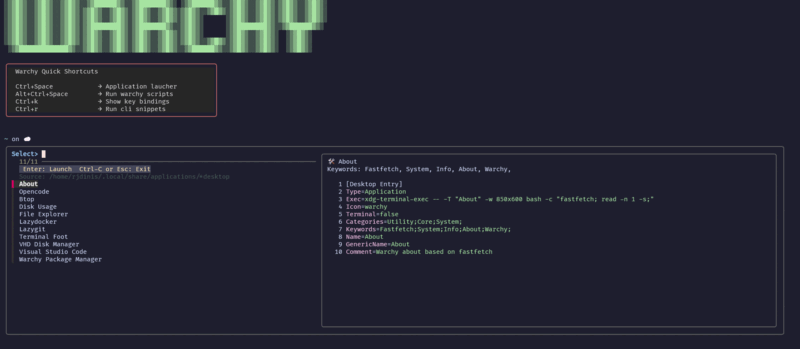

<div align="center">

# Warchy

```diff
+ ░▒▓█▓▒░░▒▓█▓▒░░▒▓█▓▒░░▒▓██████▓▒░░▒▓███████▓▒░ ░▒▓██████▓▒░░▒▓█▓▒░░▒▓█▓▒░▒▓█▓▒░░▒▓█▓▒░
+ ░▒▓█▓▒░░▒▓█▓▒░░▒▓█▓▒░▒▓█▓▒░░▒▓█▓▒░▒▓█▓▒░░▒▓█▓▒░▒▓█▓▒░░▒▓█▓▒░▒▓█▓▒░░▒▓█▓▒░▒▓█▓▒░░▒▓█▓▒░
+ ░▒▓█▓▒░░▒▓█▓▒░░▒▓█▓▒░▒▓█▓▒░░▒▓█▓▒░▒▓█▓▒░░▒▓█▓▒░▒▓█▓▒░      ░▒▓█▓▒░░▒▓█▓▒░▒▓█▓▒░░▒▓█▓▒░
+ ░▒▓█▓▒░░▒▓█▓▒░░▒▓█▓▒░▒▓████████▓▒░▒▓███████▓▒░░▒▓█▓▒░      ░▒▓████████▓▒░░▒▓██████▓▒░ 
+ ░▒▓█▓▒░░▒▓█▓▒░░▒▓█▓▒░▒▓█▓▒░░▒▓█▓▒░▒▓█▓▒░░▒▓█▓▒░▒▓█▓▒░      ░▒▓█▓▒░░▒▓█▓▒░  ░▒▓█▓▒░    
+ ░▒▓█▓▒░░▒▓█▓▒░░▒▓█▓▒░▒▓█▓▒░░▒▓█▓▒░▒▓█▓▒░░▒▓█▓▒░▒▓█▓▒░░▒▓█▓▒░▒▓█▓▒░░▒▓█▓▒░  ░▒▓█▓▒░    
+  ░▒▓█████████████▓▒░░▒▓█▓▒░░▒▓█▓▒░▒▓█▓▒░░▒▓█▓▒░░▒▓██████▓▒░░▒▓█▓▒░░▒▓█▓▒░  ░▒▓█▓▒░    
```

</div>

## Why Warchy?

**Built for Linux users stranded on Windows company laptops.**

If you're a Linux enthusiast forced to use Windows for work, Warchy is your escape hatch. It's a one-line installer that delivers a fully-configured, opinionated Arch Linux environment right inside WSL—no dual boot, no VM overhead, just pure Linux integrated seamlessly with Windows.

Warchy gives you:
- 🚀 **One-liner installation** - From zero to configured Arch in minutes
- 🎨 **Terminal-first experience** - Rich collection of modern TUIs and CLI tools
- 🔧 **Opinionated setup** - Carefully curated packages and configs so you can focus on work
- 🪟 **Native WSL integration** - Seamless interop with Windows tools and filesystem
- ⚡ **Development-ready** - Docker, dev tools, and language runtimes included

Stop compromising. Get the Linux environment you deserve, even on corporate hardware.

<div align="center">
  
</div>


## Requirements

### System Requirements
- **OS**: Vanilla Arch Linux (no derivatives like Manjaro, Garuda, EndeavourOS, CachyOS)
- **Architecture**: x86_64
- **Windows** Version 11 or 10 with WSL2 enabled
- **State**: Fresh installation (no Gnome/KDE pre-installed)
- **Permissions**: Must NOT run as root (runs as regular user with sudo)
- **Fonts**: Terminal with Nerd Fonts installed (Cascadia Code NF, JetBrains Mono NF, or Fira Code NF)

### Prerequisites
The installer checks for these requirements automatically via guard scripts before proceeding.

- If you encounter Execution Policy errors in powershell, you can change it with this command:
```powershell
Set-ExecutionPolicy -ExecutionPolicy RemoteSigned -Scope CurrentUser
```
  For more information: https://learn.microsoft.com/en-us/powershell/module/microsoft.powershell.core/about/about_execution_policies
- If the script was downloaded from the internet, it may have a Zone.Identifier that blocks execution, to manually unblock the file, run:
```powershell
Unblock-File -Path .\New-ArchWSL.ps1
```
- To check if a file has Zone.Identifier, should not contain the Zone.Identifier block:
```powershell
Get-Item -Path .\New-ArchWSL.ps1 -Stream *
```


## Installation

### PowerShell WSL Installation (Recommended for Windows)

The easiest way to install Warchy on Windows is using the PowerShell script that creates a complete WSL distribution:

1. Download the script:
```powershell
Invoke-WebRequest -Uri "https://raw.githubusercontent.com/rjdinis-nos/warchy/main/New-ArchWSL.ps1" -OutFile ".\New-ArchWSL.ps1"
```

2. Run the script with your desired configuration:
```powershell
.\New-ArchWSL.ps1 -DistroName "linuxbox" -Username "joe" -OsType "warchy" -WslBasePath "C:\WSL\VMs"
```

#### Mandatory Parameters

- **`-Username`** (Required)  
  The Linux username to create in the WSL distro. This user will have sudo privileges.  
  Example: `-Username "joe"`

- **`-WslBasePath`** (Required)  
  The base directory where WSL virtual machines will be stored. The base directory must exists, the subdirectory with the distro name will be created.  
  Example: `-WslBasePath "C:\WSL\VMs"` or `-WslBasePath "D:\Development\WSL"`

#### Optional Parameters

- **`-DistroName`** (Default: `"warchy"`)  
  The name of the WSL distribution. This will also be used as the hostname.  
  Example: `-DistroName "linuxbox"`

- **`-OsType`** (Default: `"base"`)  
  The type of installation to perform:
  - `lite` - Lightweight installation without systemd
  - `base` - Standard installation with systemd enabled
  - `warchy` - Full installation with systemd and Warchy configuration
  
  Example: `-OsType "warchy"`

- **`-VHDSizeGB`** (Default: `10`)  
  The size of the virtual hard disk in gigabytes.  
  Example: `-VHDSizeGB 20`

- **`-UserPassword`** (Default: `"changeme"`)  
  The password for the created user.  
  Example: `-UserPassword "MySecurePass123"`

- **`-WarchyBranch`** (Default: `"main"`)  
  The git branch to use when cloning the Warchy repository.  
  Example: `-WarchyBranch "develop"`

- **`-WarchyPath`**  
  Path to a local Warchy directory for testing (Windows format). Useful for development.  
  Example: `-WarchyPath "C:\Projects\warchy"`

#### Usage Examples

**Create a basic WSL Arch Linux distribution:**
```powershell
.\New-ArchWSL.ps1 -Username "john" -WslBasePath "C:\WSL"
```

**Create a full Warchy distribution:**
```powershell
.\New-ArchWSL.ps1 -DistroName "devbox" -Username "developer" -OsType "warchy" -WslBasePath "D:\WSL" -VHDSizeGB 20
```

**Create using a specific Warchy branch:**
```powershell
.\New-ArchWSL.ps1 -Username "tester" -OsType "warchy" -WarchyBranch "develop" -WslBasePath "C:\WSL"
```

**Create for local development/testing:**
```powershell
.\New-ArchWSL.ps1 -Username "dev" -OsType "warchy" -WarchyPath "C:\Projects\warchy" -WslBasePath "C:\WSL"
```

**What the PowerShell script does:**
- Creates a new WSL2 Arch Linux distribution from scratch
- Configures the virtual hard disk with specified size
- Sets up systemd (for base and warchy types)
- Creates a user with sudo privileges
- Configures SSH access
- Installs and configures Warchy (for warchy type)
- Displays connection information upon completion

### Linux Bootstrap Installation

If you already have an Arch Linux WSL distribution or native installation, use the install-warchy.sh bootstrap installer to configure Warchy:

```bash
curl -LsSf https://raw.githubusercontent.com/rjdinis-nos/warchy/refs/heads/main/install.warchy.sh | sh
```

#### Custom Installation Options

You can customize the installation with environment variables:

```bash
# Install from a specific branch
WARCHY_BRANCH=develop curl -LsSf https://raw.githubusercontent.com/rjdinis-nos/warchy/refs/heads/main/install.warchy.sh | sh

# Use custom installation directory (XDG_DATA_HOME)
XDG_DATA_HOME="$HOME/custom" curl -LsSf https://raw.githubusercontent.com/rjdinis-nos/warchy/refs/heads/main/install.warchy.sh | sh
```

**What the bootstrap installer does:**
- Updates pacman and installs git if needed
- Clones the repository to `~/.local/share/warchy` (or `$XDG_DATA_HOME/warchy`)
- Optionally checks out a specific branch via `WARCHY_BRANCH`
- Automatically runs the main `install.sh` script

### Manual Installation on a vanilla archlinux

1. Clone the repository:
```bash
git clone https://github.com/rjdinis-nos/warchy.git ~/.local/share/warchy
cd ~/.local/share/warchy
```

2. Run the installer:
```bash
bash install/install.sh
```

### Installation Process Details

For a comprehensive understanding of the installation process, including detailed flow diagrams, stage breakdowns, and customization options, see:

**[install/README.md](install/README.md)** - Complete Installation System Documentation

This documentation covers:
- Installation flow with visual stage diagram (6 stages: Pre-install → Config → Base → Optional → Setup → First-run)
- Detailed explanation of each installation script
- Environment variables and control flags
- Package lists and management
- Logging system and error handling
- Customization guide for adding new checks, configs, and packages
- Testing and troubleshooting procedures

## Post-Installation Setup

After installation, run `warchy-user-setup` to configure your development environment:

```bash
warchy-user-setup
```

This interactive tool configures:
- **VHD mounting** for SSH keys (Windows/WSL paths)
- **Git settings** (name, email, GPG signing)
- **SSH agent** and key management
- **Git remote** conversion (HTTPS → SSH)
- **GitHub CLI** authentication

All steps are optional and preserve existing configurations.

## Utility Scripts

Warchy includes a rich collection of utility scripts for various tasks. For complete documentation on all available scripts including launchers, notifications, package management, and more, see:

**[bin/README.md](bin/README.md)** - Complete Utility Scripts Documentation

Key utilities include:
- **warchy-launcher** (`Alt+A`) - Interactive application launcher
- **warchy-packages** (`Alt+P`) - Package management TUI
- **warchy-shortcuts** (`Alt+K`) - Keyboard shortcuts display
- **warchy-snippets** (`Alt+S`) - Command snippets browser
- **warchy-notify** - WSL-Windows notification bridge
- **warchy-user-setup** - Post-installation configuration tool

### WSL Integration

**warchy-notify**
```bash
warchy-notify -t "Title" -m "Message" [options]
```

Sophisticated WSL-Windows notification bridge:
- Sends Windows 11 toast notifications from WSL
- Supports custom icons and expiration times
- Automatically mirrors icons to Windows temp directory
- Parses `/etc/wsl-distribution.conf` for distribution icons

Options:
- `-t, --title` - Notification title (required)
- `-m, --message` - Notification body (required)
- `-l, --level` - Severity: info, warn, error, critical
- `-e, --expire` - Expiration time in minutes

Example:
```bash
warchy-notify -t "Build Complete" -m "Project built successfully" -l info -e 5
```

### WSL Interop Configuration

Enable Windows interoperability in WSL:

### WSL Interop Configuration

WSL interop is automatically configured during installation via `/etc/wsl.conf`.

**Configuration includes**:
- Windows path appending
- Interop enabled
- Metadata support
- Network hostname generation


## Configuration System

Warchy includes a comprehensive configuration system for a complete development environment.

### Modular Bash Configuration

Located in `config/bash/`, the system provides:

**Core Files**:
- `rc` - Main loader sourced by `~/.bashrc`
- `shell` - Shell options and behavior
- `envs` - Environment variables (GOPATH, XDG dirs, etc.)
- `aliases` - Command aliases (eza, bat, docker shortcuts)
- `functions` - Custom shell functions
- `init` - Initialization scripts (starship, fzf)
- `keybindings` - Custom key bindings
- `inputrc` - Readline configuration

### Application Configurations

**Terminal & Display**:
- `foot/` - Wayland terminal emulator config
- `xterm/` - X11 terminal config
- `starship/` - Cross-shell prompt
- `tmux/` - Terminal multiplexer

**Development Tools**:
- `git/` - Git configuration and aliases
- `vim/` - Vim settings
- `nvim/` - Neovim with LazyVim (auto-installed)
- `npm/` - Node.js package manager

**System Services**:
- `dunst/` - Notification daemon configuration
- `systemd/` - See default/systemd for systemd service configurations

**Desktop Integration**:
- `dunst/` - Notification daemon configuration
- `fastfetch/` - System information display
- `yazi/` - File manager with Catppuccin theme

All tools respect XDG directories for clean home directory.


## Package Management

Warchy features a modern, configuration-based package management system for installing optional software beyond the base installation.

### Quick Start

Launch the interactive package browser:

```bash
warchy-packages
```

Or use the keyboard shortcut: **`Alt+P`**

### Available Packages

Managed packages include:

- **Development**: `docker`, `go`, `npm`, `pnpm`, `rust`, `opencode` (VS Code web)
- **Cloud**: `gcloud` (Google Cloud SDK)
- **Tools**: `yay` (AUR helper), `vhdm` (VHD management), `posting` (HTTP client)

### Command-Line Usage

```bash
# Install a package (must be sourced to export environment variables)
source "$WARCHY_PATH/bin/install/warchy-pkg-manager" install docker

# Remove a package
source "$WARCHY_PATH/bin/install/warchy-pkg-manager" remove docker

# Direct package installation (without configuration)
warchy-pkg install pacman package1 package2
```

### How It Works

Each package is defined by a `.conf` file in `~/.config/warchy/install/` that specifies:

- Packages to install (via pacman or yay)
- Environment variables to export
- Pre/post install hooks
- Cleanup commands on removal
- Git repositories to build from source

The system automatically:
- ✓ Manages environment variables in your shell session
- ✓ Persists configuration to `~/.config/bash/envs`
- ✓ Handles build dependencies for git-based packages
- ✓ Provides clear status feedback via interactive UI

### Detailed Documentation

For complete documentation on creating custom package configurations, understanding the architecture, and helper functions reference, see:

**[bin/install/README.md](bin/install/README.md)** - Complete Package Management System Documentation

This includes:
- Architecture overview and component details
- Configuration file format (regular packages and git-based)
- Environment variable management
- Helper functions reference
- Creating custom package configurations
- Migration guide from old system
- Troubleshooting and debugging


## Documentation

- [AGENT.md](AGENT.md) - AI development guidelines and coding standards
- [CHANGELOG.md](CHANGELOG.md) - Historical changes and architectural decisions
- [install/README.md](install/README.md) - Installation process details
- [bin/README.md](bin/README.md) - Utility scripts reference
- [bin/install/README.md](bin/install/README.md) - Package management system

## Contributing

Contributions are welcome! Please:

1. Fork the repository
2. Create a feature branch
3. Make your changes
4. Test on a fresh Arch installation
5. Submit a pull request

### Code Style

- Use bash strict mode: `set -eEuo pipefail`
- Include descriptive comments
- Follow existing naming conventions
- Test error handling paths
- **Update documentation** when making changes (see [AGENT.md](AGENT.md))

## License

MIT License

See the [LICENSE](LICENSE) file for full details.

## Acknowledgments

- [omarchy](https://omarchy.org/) - Code inspiration and architectural patterns
- [gum](https://github.com/charmbracelet/gum) - Glamorous shell scripts
- [Arch Linux](https://archlinux.org/) - The base distribution
- All the amazing CLI tools included in the package lists

## Support

For issues, questions, or contributions:
- Open an issue on GitHub
- Check the installation log for detailed error information
- Review the [Arch Wiki](https://wiki.archlinux.org/) for system-specific issues

---

**Note**: This is an opinionated Arch Linux setup. Review the package lists and configurations before installation to ensure they meet your needs.
